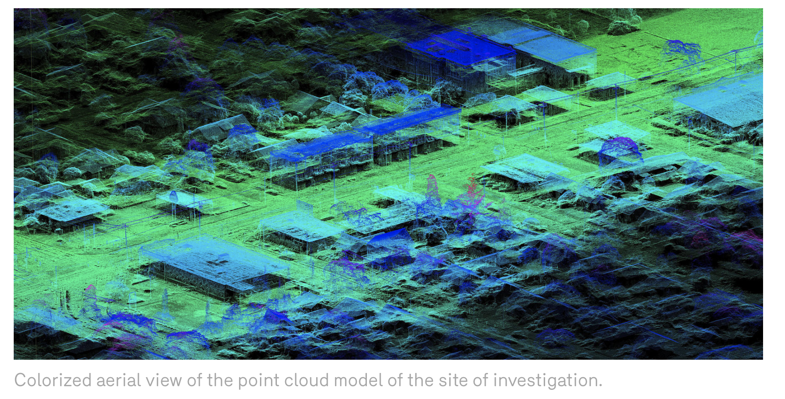
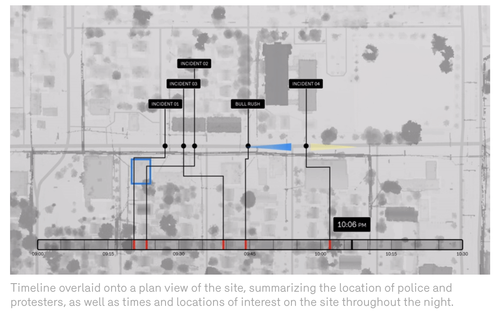
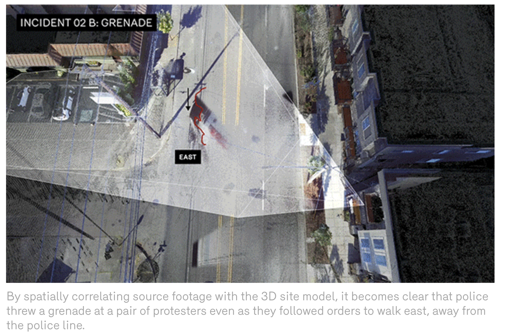

Jin Ning Huang  
GEOG 458  
3/3/2021  

# ESSAY FOR SITU Research

Image source are from the SITU wesbite. Here's the [Link](https://situ.nyc/research/projects/portland-protest-reconstruction).
___________________________________________

### Introduce this digital-geography project

I decided to choose an interesting and unique project called “Portland Protest Reconstruction” and it is published by SITU Research. In short, SITU is an institution that focuses on unconventional architectural practices for social impact and racial injustice. For this project, it was made geo-narrative to reexplain what happened during the Portland Protest. More specifically, SITU wants to recreate the context of the police’s unfair use of weapons against harmless protesters. During that time, there was racial injustice when the police killed George Floyd and the reaction caused many uproars from the public. Many people who had participated in the Black Lives Matter, especially protests, for letting the voice be heard for stopping the police power on the Black community and also to stop the racial system. Portland Protest was brought to all attention due to the Portland police for violating the restrictions on the use of “less-lethal” weapons.

  

***Caption: capture the video of what the project would look like***

The project was made by SITU along with the collaborators from Don’t Shoot Portland, Oregon Justice Resource Center, Levi Merrihew Horst, and Albies & Stark. The SITU was being commissioned by those collaborators to make cloud point analysis to provide context to the court. There was a lawsuit against Portland police for being accountable for using tear gas and weapons. As the research was published after the court case was dismissed, the audience can be anyone who comes across this project. This project can be good for non-American or non-Portland residents to “visually” read and learn about the incident. This project could also target people who seek social justice and want to spread out awareness of the problem. It also could be someone who wants to learn what point cloud analysis can be used for.

What is interesting about this project is that unlike displaying a dashboard or any 2-D mapping on a website, it displays a timestamp of a 3-D point cloud overlaying with a short clip at the same time. The major functions were pretty limited, as I can only watch the video. The project displays as storytelling that as I continue to watch small clips with point clouds, I also get the explanation of how they made the models and the story behind it. Therefore, the project doesn’t have any web map elements such as scalar bar, north arrow, legend, or even user interactions too! I can only watch short loop clips of the recorded video that match with the 3-D model background during the protest. The project also has a bird view map that explains the timeline of the protest incident.

As far as I assumed, the data source was mostly images and media, unlike data numbers, or data table format. They used drone photogrammetry and laser scans to capture point cloud models. The area they were trying to reconstruct was the street of North Lombard Street, a street as the epicenter of the night’s violence.  They also used short videos from social media and people who had been recording during that incident. They use those clips to match the spatial view with the 3-D model and are also credited to the owners of the clips.

### Describe the systematic architecture

Since SITU created a website as an article format, this might be the client-side. Readers like me can only see the videos and words. I don’t see the server, services, or data clearly on this website; but, I believe what the articles explain could give us some insight into the process they did. Most of the data are from the drone that captures images and also there are short videos from the people being recorded during the protest. The server and services could be SITU using the software that generates the drone photos into point cloud models. They could also be using other services to help layout the video clips to match the shape of the models. With how the data flowed in between the client and server, they might have processed the data from software and then placed those data into HTML and assets folders. I had noticed that HTML files have a bunch of images tag that show the 3-D models, so I am assuming that they were not doing a full-stack website that has the back-end delivering the data to the front-end. As I open the inspector on this site, I can see that some CSS and JS files were made although it is hard to read the code. As for the major functions of this systemic architecture, the website provides four-minute videos to allow readers to see everything. I can simply press the play button as a normal video. Another function is that for images or short loop videos, my regular computer arrow changes into the big black “plus” sign as I hover them. I can click them and it will enlarge the image bigger, isolating it from the rest. There was a small caption below the enlarged image. Also, I could use their left/right arrow to change to different images, and there is a big “X” sign to exit out.

### Critique its overall UI/UX and Web Mapping design

  

As for the UI/UX, I would say that the video and the loop clips did a good job of grabbing the attention, and I would already forget that this project doesn’t have a typical dashboard or map interaction. The project has a website that acts as an article, and it is easy to follow along. From reading top to bottom, there was no confusion or any missing information for me. The amount of wording and images are evenly distributed, as I don’t get distracted easily from reading words too much and images are evenly spread out. I think it is a great idea how SITU puts the video before everything because it can be helpful for readers who prefer to watch rather than reading everything. Once again, the project doesn’t support responsive design as there aren’t any interactions to play with. The project also doesn't have an interactive map design; although, there is only one map that you can watch on. That map only has a base map (or a thematic map) with bright and dark contrast to display the difference between the land and buildings/trees. It has a timeline in hour and minute units as to how the map would change over time. There were two arrows, one for police and another for protesters. The only moving right or left as to symbolizes their movement over time. Lastly, there would be dots that represent the major incidents occurring during a certain time. Once again, this mapping doesn’t have map interaction as it is a clip; I can only click on it to enlarge the image.

### Analyze the pros and cons of the examined project, and discuss anything else you feel worthy to share

The pros of the project are very creative. It doesn’t show how you would normally interact with the map; yet, you would still be able to understand the story. It is also very simple to use and you wouldn’t feel overwhelmed with too many mapping elements. The reading is also very engaging because the explanation was straightforward and short. The cons would be the limitation of the user interaction. As I said before, the project felt like an article since there were just words and images. Sometimes, I want to go try and play around with the model so my suggestion is to create an external site where users can have more freedom to look around. Users would be able to choose to move the view and observe differently at certain incidents. I could say the same thing for the map. My suggestion is to allow users to control and pause the animation, which can allow developers to get more creative on the map to display (like a pop-up on the incident dot). Overall, I really like how this project displays because you can get to see more information on the third dimension than the second dimension. It is really clever to use point cloud and scanning tools to capture a grenade very clearly as proof of the police's misuse of weapons. This is something that I can imagine using as a “3-D video” proof in the future for the court or evidence.

  

### Reflect upon this project with the references of the readings

Reflecting on this project reminded me of Week 1 reading. James Ash wrote about how digital technology changed the concepts of Geography and Human Geography. Throughout time as technology is advancing, the ability to map grows more flexible and accessible. From the cartography of hand-drawing the map to point cloud and 3-D models. The project does represent how efficient a 3-D map can explain the story without the core element (scale, compass, title, etc), and it is useful to bring out more information than the limitation of the original 2-D map. James also mentioned how digital technology helps explain the research on Human Geography. The project is about racial injustice and lawsuits. The purpose of this project is to show the court the proof that the police were abusing the weapon. This isn’t something that had happened in the past because a study of Geography was used to be just a mapping and research paper. Now, Geography can be something abstract that allows cooperation with other study fields, such as urban development, politics, and especially data science.
